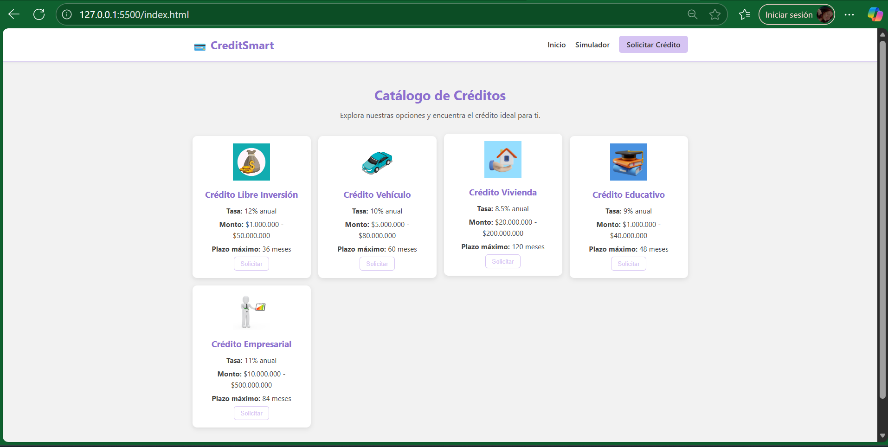
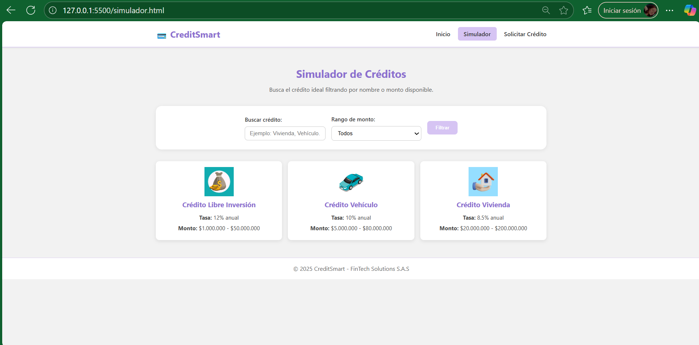
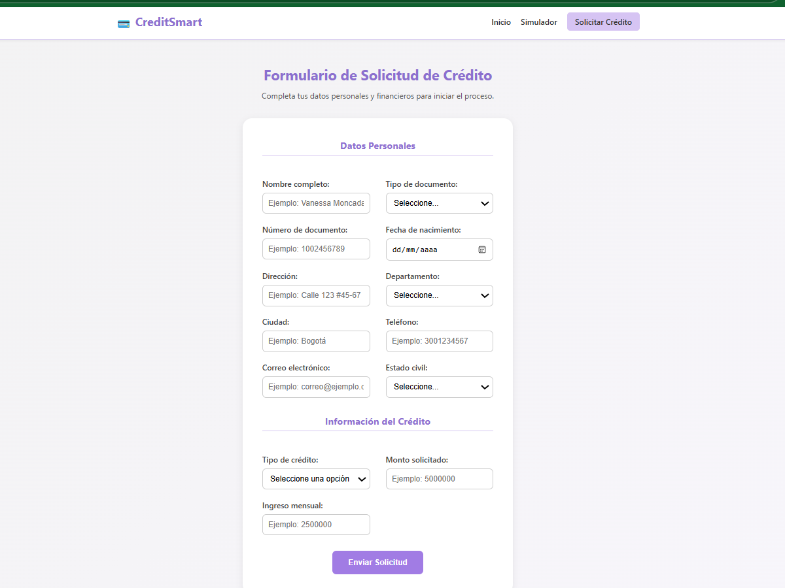

# 💳 CreditSmart

**Nombre del estudiante:** Vanessa Moncada Ramirez 
**Proyecto:** Sitio web para simulación y solicitud de créditos  

---

##  Descripción del proyecto

**CreditSmart** es un sitio web educativo desarrollado con **HTML5** y **CSS3**,  
que permite a los usuarios conocer diferentes tipos de créditos,  donde se  
simulan opciones de financiamiento y asi poder enviar una solicitud de crédito en línea.

El diseño es profesional y mas adaptable, adaptándose a dispositivos móviles, tabletas y escritorio.

---

## Estructura del proyecto

---

## 🚀 Instrucciones para ejecutar el proyecto

1. Clona o descarga este repositorio.  
2. Abre la carpeta **CreditSmart**.  
3. Ejecuta el archivo `index.html` en cualquier navegador web.

---

## 📸 Capturas de pantalla

## 📸 Capturas de pantalla

### 🏠 Página principal

### 🔍 Simulador de créditos

### 📝 Solicitud de crédito

---

## 🧩 Aspectos técnicos

- Estructura semántica HTML5  
- Diseño visual con CSS3  
- Diseño **adaptable** (desktop, tablet, móvil)  
- Navegación entre páginas  
- Autorización de uso de datos personales en formulario  
- Organización del código y buenas prácticas  

---

## 🧾 Commits realizados

- Estructura HTML de página principal  
- Estilos y diseño mas adaptable 
- Simulador de créditos  
- Formulario de solicitud completo  
- Mejora estética y secciones separadas  
- Autorización de datos personales  
- Documentación final del proyecto

---

## 👩‍💻 Autor

**Vanessa Moncada Ramirez**  
Desarrollado como parte de la Actividad 1 – Curso de Diseño Web  
Fecha: 09/11/2025
